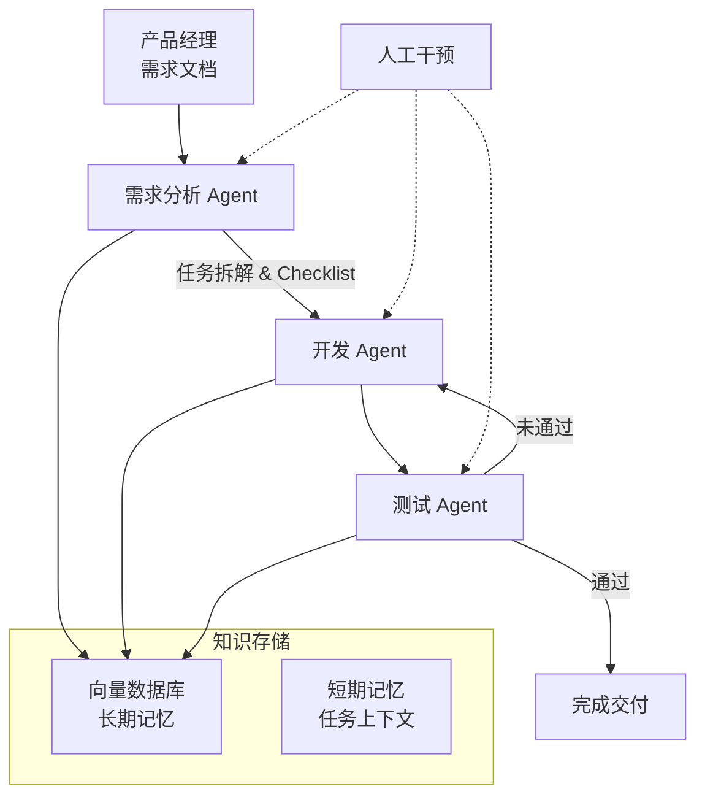
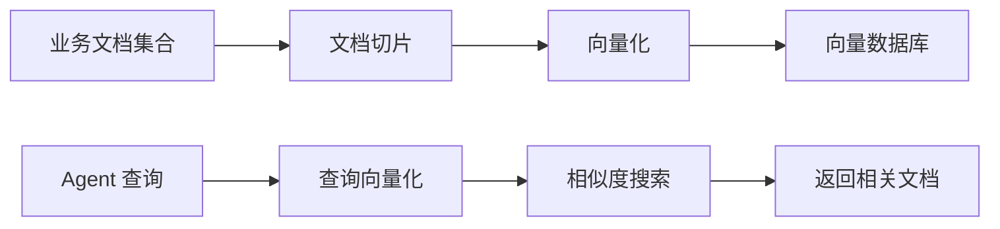
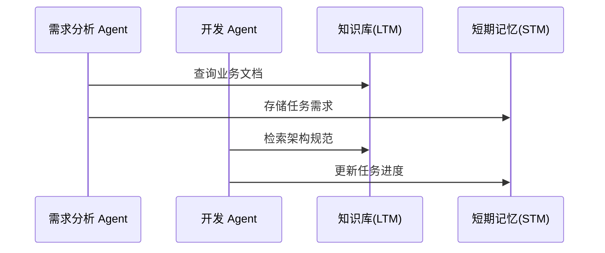
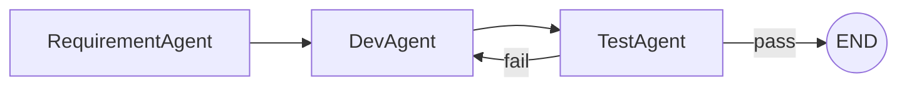
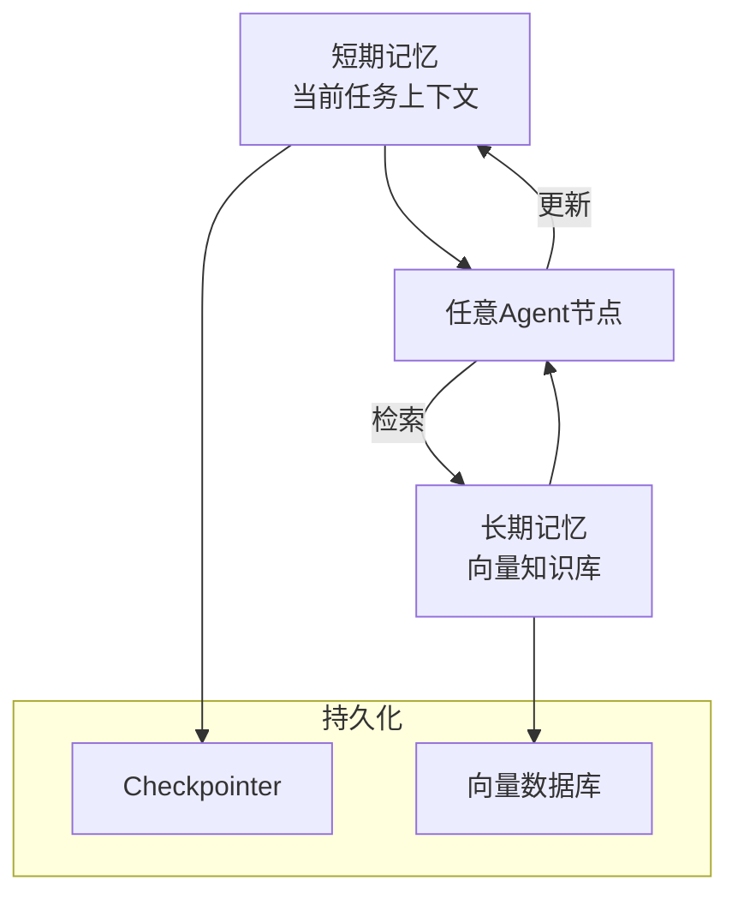
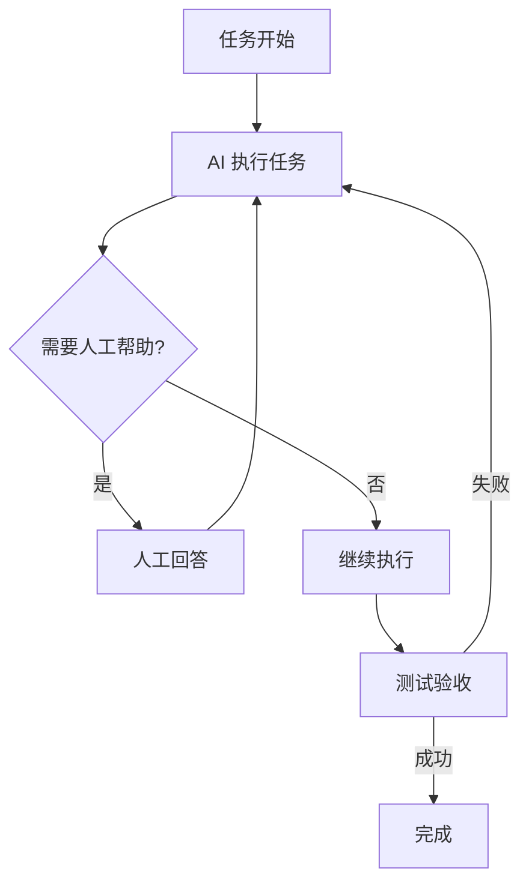
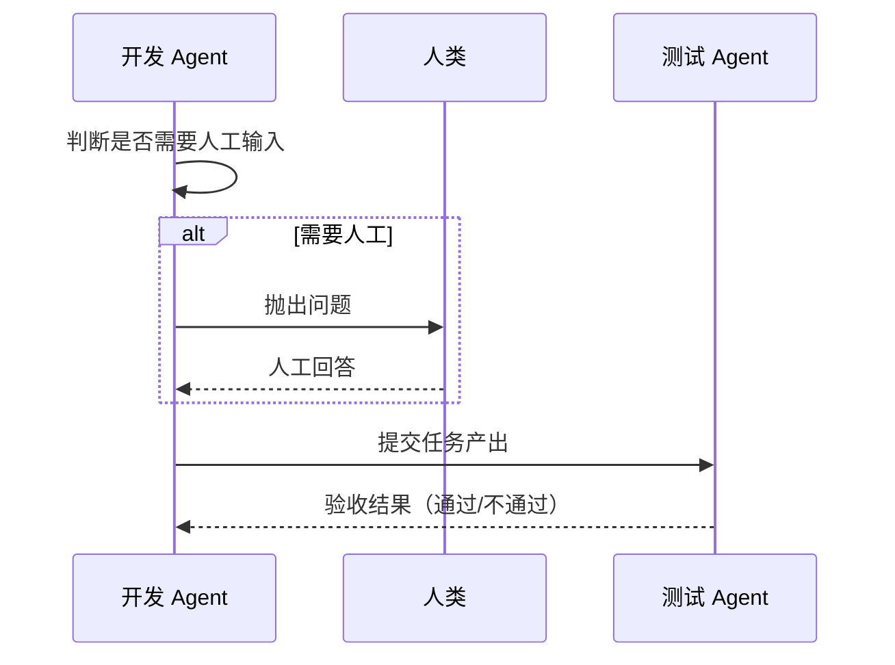

## 背景

捏脸业务是当前已有的 C 端业务模块，已具备完整的代码工程和业务逻辑。  
目标是基于现有业务知识，构建一个 自动化 AI Coding Agent 系统，实现：

- 对代码进行深度分析，生成业务文档（业务页面文档、技术架构文档、前端设计规范）
- 构建向量知识库（长期记忆）
- 使用 LangGraph.js 构建多角色 Agent 协同的代码生成与测试工作流
- 支持任务循环、自动修正以及人工干预
- 遵循 上下文工程 思路，区分长期记忆和短期记忆

## 技术选型

- 编程语言：Node.js
- 核心框架：
  - LangGraph.js — 多Agent工作流编排
  - LangChain.js — LLM调用与RAG检索
- 向量数据库：Chroma / Milvus / Weaviate（可选）
- 上下文工程：基于 Context-Engineering 方法论
- LLM：可使用 OpenAI / Claude / 其他 API

## 整体架构

### 架构总览



- 各 Agent 均可访问 长期记忆（向量知识库）
- 短期记忆 用于保存当前任务的进度和状态
- 人工可在任意节点介入

### 知识库设计

设计要点：

- 数据来源：代码分析生成的业务文档、技术架构文档、前端设计规范
- 切分：按语义切片（chunking）
- 嵌入：使用 Embedding 模型
- 存储：向量数据库
- 检索方式：RAG（检索增强生成）



示例代码（构建知识库）：

```javascript
import { Chroma } from "@langchain/community/vectorstores/chroma";
import { OpenAIEmbeddings } from "@langchain/openai";
import fs from "fs";

async function buildKnowledgeBase() {
  const docs = fs.readFileSync("./docs/business.md", "utf-8");
  const chunks = splitText(docs, 500); // 分片
  const embeddings = new OpenAIEmbeddings();
  const vectorStore = await Chroma.fromTexts(chunks, {}, embeddings);
  await vectorStore.persist();
}
```

### Workflow设计



#### 各个Agent角色的设计



角色说明：

- RequirementAgent：解析需求 → 生成任务列表 & checklist
- DevAgent：根据任务生成代码
- TestAgent：执行测试，决定是否回退到开发

示例代码（LangGraph.js 节点定义）：

```javascript
import { StateGraph, Command } from "@langchain/langgraph";

const builder = new StateGraph({ tasks: [] });

builder.addNode("RequirementAgent", async (state) => {
  const tasks = await generateTasks(state.requirements);
  return new Command({ goto: "DevAgent", update: { tasks } });
});

builder.addNode("DevAgent", async (state) => {
  const code = await generateCode(state.tasks[0]);
  return new Command({ goto: "TestAgent", update: { code } });
});

builder.addNode("TestAgent", async (state) => {
  const pass = await runTests(state.code);
  return new Command({ goto: pass ? "END" : "DevAgent" });
});

const graph = builder.compile();
```

#### Workflow中长期记忆和短期记忆的划分



- 短期记忆：StateGraph 内的 state 对象
- 长期记忆：向量数据库检索的文档
- 持久化：checkpointer 保存状态，保证中断可恢复

示例代码（记忆调用）：

```javascript
const relatedDocs = await vectorStore.similaritySearch(taskDescription, 3);
state.context = [...state.context, ...relatedDocs];
```

#### 任务循环和人工介入





- 任意Agent可触发人工介入
- 人工介入后可继续执行任务
- 测试失败 → 回到开发 Agent

示例代码：
Node 定义（判断人工介入）

```javascript
import { Node } from "@langchain/langgraph";

const humanInterventionNode = new Node({
  name: "human_intervention",
  description: "判断并处理人工介入",
  run: async (context) => {
    const { taskContext, llm } = context;

    const decision = await llm.invoke(`
      任务内容：${taskContext}
      判断是否需要人工帮助，返回 JSON：{"needHuman": true/false, "question": "若需要，给出具体问题"}
    `);

    if (decision.needHuman) {
      // 暂停执行，等待人工输入
      context.state = "WAITING_FOR_HUMAN";
      context.humanQuestion = decision.question;
      return { status: "paused_for_human", question: decision.question };
    }

    return { status: "continue" };
  }
});

export default humanInterventionNode;
```

人工输入在代码中的表现

```javascript
// 人工输入回调接口
app.post("/human-response", async (req, res) => {
  const { taskId, answer } = req.body;
  
  // 将人工回答注入短期记忆
  shortTermMemory[taskId].push({
    role: "human",
    content: answer
  });

  // 恢复执行 AI 流程
  await workflow.resumeFromNode(taskId, "human_intervention");
  res.send({ status: "resumed" });
});
```
