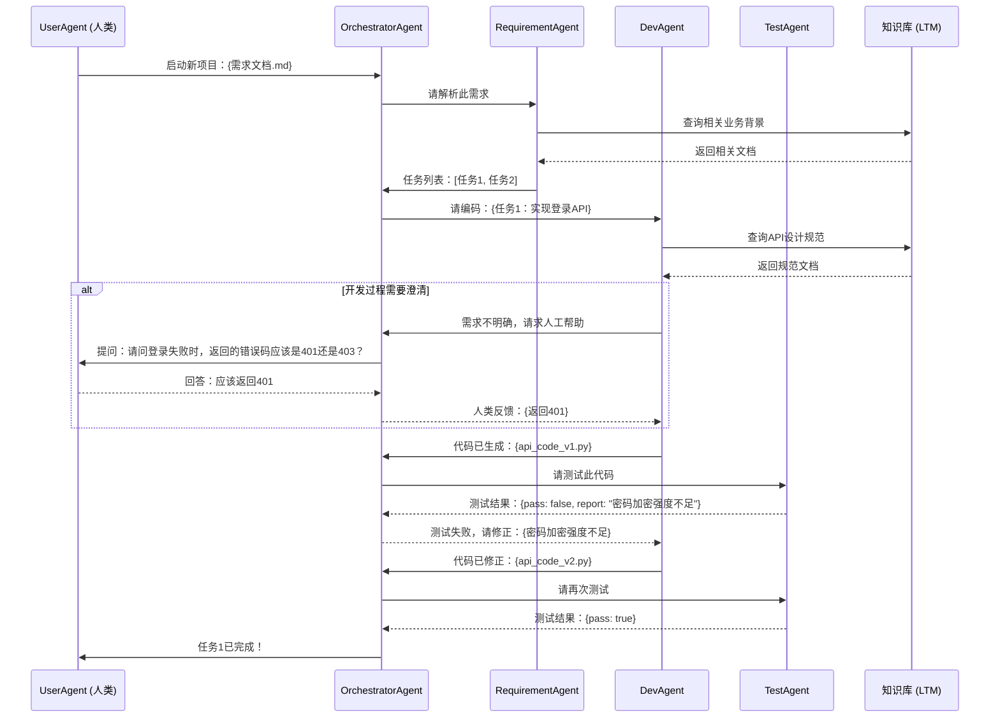

# AI Coding Agent 系统需求文档 (AgentScope 版)

## 1\. 背景

目标是基于现有业务知识，构建一个自动化 AI Coding Agent 系统，实现以下功能：

- 对现有代码库进行深度分析，自动生成业务文档、技术架构文档和前端设计规范。
- 基于生成的文档，构建一个向量知识库作为系统的长期记忆。
- 使用 **AgentScope** 框架构建一个由多角色 Agent 协同的代码生成与测试工作流。
- 支持开发-测试-修正的任务循环，并能实现自动修正。
- 在关键节点支持人工干预，确保流程的可控性。
- 遵循上下文工程思路，清晰地划分和使用长期记忆（知识库）与短期记忆（任务上下文）。

## 2\. 技术选型

- **编程语言**: **Python**
- **核心框架**:
  - **AgentScope**: 用于多 Agent 的定义、通信和工作流编排。
  - **LangChain / LlamaIndex (Python)**: 用于辅助 LLM 调用、文档加载、切片和 RAG 检索。
- **向量数据库**: Chroma / Milvus / Weaviate (可选其一)。
- **上下文工程**: 沿用 Context-Engineering 方法论。
- **LLM**: 可通过 AgentScope 配置，支持 OpenAI / Claude / Qwen / 其他各类模型 API。

## 3\. 整体架构 (基于 AgentScope)

AgentScope 的核心是基于消息传递的协同模型。为了管理复杂的、有状态的工作流，我们引入一个核心的 **`OrchestratorAgent` (编排 Agent)** 作为项目经理，负责驱动整个流程、分发任务和做出决策。

### 3.1. 架构总览

```mermaid
graph TD
    subgraph AgentScope Workflow
        U[用户 UserAgent] --> O[编排 Agent <br/> OrchestratorAgent]
        O --> RA[需求分析 Agent <br/> RequirementAgent]
        RA -->|任务列表| O
        O --> DEV[开发 Agent <br/> DevAgent]
        DEV -->|代码产出| TEST[测试 Agent <br/> TestAgent]
        TEST -->|测试结果| O
        O -- "通过" --> DONE[完成交付]
        O -- "不通过，附带失败信息" --> DEV
    end

    subgraph 知识存储
        KB[向量数据库 <br/> 长期记忆 (LTM)]
        STM[消息历史 <br/> 短期记忆 (STM)]
    end

    %% Agent 与知识库的交互
    RA <--> KB
    DEV <--> KB
    TEST <--> KB

    %% 人工干预通过编排Agent进行
    H[人工干预] -- "通过UserAgent" --> O
```

**核心设计思想**:

- **中央编排**: `OrchestratorAgent` 是流程控制中心，取代了 LangGraph 中的图结构定义。
- **消息驱动**: Agent 之间通过传递消息进行通信。流程的推进是基于 `OrchestratorAgent` 对收到的消息内容进行判断和决策。
- **自然的人机交互**: `UserAgent` 是框架的一等公民，可以无缝地将人类操作者集成到工作流中。

### 3.2. Agent 角色设计

在 AgentScope 中，每个 Agent 都是一个独立的类，其核心逻辑在 `reply` 方法中实现。

#### 3.2.1. OrchestratorAgent (编排 Agent)

- **职责**:
  - 接收用户的初始需求。
  - 调用 `RequirementAgent` 将需求分解为结构化的任务列表。
  - 管理任务队列，按顺序或并行分发任务。
  - 将 `DevAgent` 生成的代码交给 `TestAgent`。
  - 根据 `TestAgent` 的测试结果，决定是将任务打回给 `DevAgent` 进行修复（**形成循环**），还是标记为完成。
  - 在流程中需要人工决策或输入时，主动向 `UserAgent` 发起询问。

#### 3.2.2. RequirementAgent (需求分析 Agent)

- **职责**:
  - 接收原始需求文档。
  - **查询 (LTM)** 向量知识库，获取相关的业务背景和既有规范。
  - 调用 LLM，生成详细、结构化的任务列表 (Checklist)。
  - 将生成的任务列表作为消息返回给 `OrchestratorAgent`。

#### 3.2.3. DevAgent (开发 Agent)

- **职责**:
  - 接收来自 `OrchestratorAgent` 的单个开发任务（其中可能包含测试失败的反馈）。
  - **查询 (LTM)** 向量知识库，检索相关的技术架构、代码规范或相似的代码片段。
  - 构建包含任务要求、知识库上下文和修正意见的 Prompt。
  - 调用 LLM 生成代码。
  - 将生成的代码块作为消息返回。

#### 3.2.4. TestAgent (测试 Agent)

- **职责**:
  - 接收 `DevAgent` 生成的代码。
  - 执行测试。测试方式可包括：
    - 调用代码静态分析工具 (Linter)。
    - 让 LLM 生成单元测试代码并执行。
    - 根据预设的测试用例进行逻辑评估。
  - 生成结构化的测试报告（例如：`{"pass": true/false, "report": "错误详情..."}`），并返回给 `OrchestratorAgent`。

## 4\. 知识库设计 (长期记忆 LTM)

知识库的设计与上层 Agent 框架解耦，可以独立实现并作为服务供 Agent 调用。

### 4.1. 构建流程

构建流程与原始设计保持一致。

```mermaid
graph LR
    Docs[业务/技术文档集合] --> Split[语义化文档切片]
    Split --> Embed[向量化 (Embedding)]
    Embed --> VDB[存入向量数据库]
```

### 4.2. 检索流程 (RAG)

在每个 Agent 的 `reply` 方法内部，通过调用 RAG 函数来实现与长期记忆的交互。

```mermaid
graph LR
    Query[Agent 查询 <br/> "实现用户登录功能"] --> QEmbed[查询向量化]
    QEmbed --> Search[在向量数据库中<br/>进行相似度搜索]
    VDB[向量数据库] --> Search
    Search --> Result[返回相关文档片段]
```

**Python 伪代码示例 (在 Agent 内部调用)**:

```python
# RAG 服务可以被封装成一个工具函数
def retrieve_from_kb(query_text: str, k: int = 3):
    # vector_store 是预先加载的向量数据库实例
    docs = vector_store.similarity_search(query_text, k=k)
    return [doc.page_content for doc in docs]

# DevAgent 的 reply 方法中
class DevAgent(AgentBase):
    def reply(self, message):
        task_description = message.content
        
        # 从长期记忆 (LTM) 中检索相关知识
        relevant_docs = retrieve_from_kb(f"关于'{task_description}'的技术架构规范")
        
        prompt = f"""
        任务：{task_description}
        相关架构规范：{relevant_docs}
        请根据以上信息生成代码。
        """
        # ... 后续调用 LLM 并返回结果 ...
```

## 5\. Workflow 中的记忆划分

AgentScope 为长短期记忆提供了非常自然的映射。

```mermaid
graph TB
    STM[短期记忆 <br/> Agent 的 Message History] --> Agent
    LTM[长期记忆 <br/> 向量知识库 (外部调用)] --> Agent
    Agent[任意 Agent 节点]

    subgraph 持久化存储
        MSG[消息历史日志]
        KB[向量数据库]
    end

    Agent -- "对话交互" --> |更新| STM
    Agent -- "RAG查询" --> |检索| LTM
    LTM --> KB
    STM --> MSG
```

- **短期记忆 (STM)**: 直接对应 AgentScope 中每个 Agent 自带的 `memory` 属性。它自动记录了 Agent 的完整对话历史，构成了当前任务的上下文。`OrchestratorAgent` 的 `memory` 完整地记录了整个任务的生命周期。AgentScope 的 `memory` 支持持久化，可以实现任务的中断和恢复。
- **长期记忆 (LTM)**: 对应外部独立的向量知识库。它是无状态的，通过 RAG 函数在需要时被动查询。

## 6\. 任务循环与人工介入

### 6.1. 任务循环 (开发-测试)

任务循环由 `OrchestratorAgent` 的决策逻辑驱动，而非图的边。

1. `OrchestratorAgent` 将开发任务发给 `DevAgent`。
2. `DevAgent` 回复代码后，`OrchestratorAgent` 将代码转发给 `TestAgent`。
3. `TestAgent` 回复测试结果。
4. `OrchestratorAgent` 检查测试结果：
      - 若 **失败**，则将失败报告连同原始任务一起，**再次**发送给 `DevAgent`，形成闭环。
      - 若 **成功**，则结束循环，继续处理下一个任务。

### 6.2. 人工介入

通过 `UserAgent` 实现，流程自然，无需特殊状态管理。

- **触发**: 任何 Agent 在其 `reply` 方法中，可以通过逻辑判断（如 `if ambiguity_detected:`）来决定是否需要人工帮助。
- **执行**: 需要帮助的 Agent 直接向 `UserAgent` 发送一个提问消息。
- **暂停与恢复**: AgentScope 的消息中心 (`msghub`) 会自动将问题输出到控制台并等待用户输入。用户输入后，`UserAgent` 将回答作为消息返回给提问的 Agent，工作流自动恢复。

### 6.3. 完整交互流程示例


